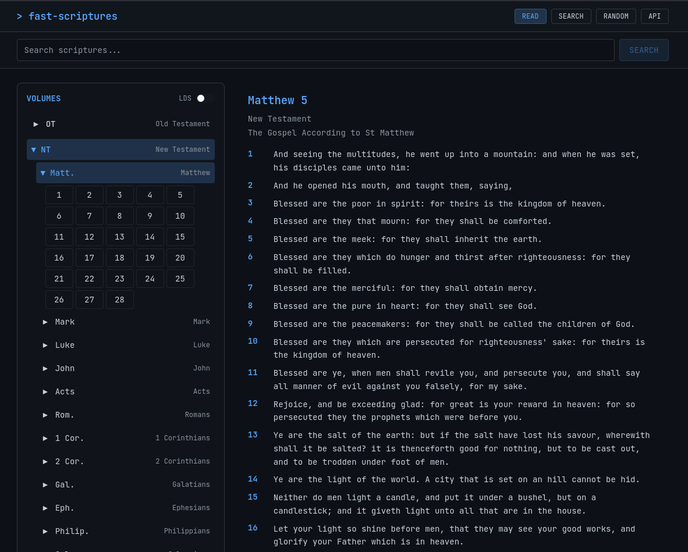

# Fast Scriptures

A modern, mobile-first scripture reading application that makes exploring the LDS scriptures fast, beautiful, and accessible.



## Motivation
- I wanted to kick the tires on Python's FastAPI and React
- I recently found `uv` and prefer it over `pip`
- I wanted a playground where I could run tests, use github actions, tinker with apm and observability
- I wanted to keep my web development skills fresh

## ✨ Features

- Read the scriptures
- Search the scriptures
- Get a random scripture
- open scripture API


## 🚀 Getting Started

### Welcome!

👋 Whether you want to contribute, explore, or just run the app locally, we've got you covered:

**[📖 Getting Started Guide](./docs/getting-started.md)** - Complete setup instructions and your first contribution

**[📚 Documentation Hub](./docs/README.md)** - All documentation organized and (hopefully) easy to navigate

### Quick Start

Want to see it in action? Visit the live app: **[scriptures-fast-api.onrender.com](https://scriptures-fast-api.onrender.com)**

### Quick Local Setup

```bash
# Clone and setup
git clone https://github.com/willwillis/fast-api-scripture-app.git
cd fast-api-scripture-app
git submodule update --init --recursive

# Backend (Terminal 1)
cd backend && uv sync && python setup_database.py
uv run uvicorn app.main:app --reload --host 0.0.0.0 --port 8000

# Frontend (Terminal 2)
cd frontend && npm install && npm run dev
```

Visit http://localhost:5173 to see your local version!

## 🏗️ Architecture

Fast Scriptures is built with a modern, clean architecture:

- **Frontend**: React 18 + TypeScript + Tailwind CSS + Vite
- **Backend**: FastAPI + Python + SQLite
- **Data**: LDS Scriptures database (as git submodule)
- **Deployment**: Render (auto-deploy from main branch)
- **CI/CD**: GitHub Actions with comprehensive testing

See our **[Architecture Overview](./docs/architecture.md)** *(coming soon)* for detailed system design.

## 🤝 Contributing

This is a personal project, and the functinoality is a bit contrived, but if you want to contribute, here's how to get involved:

1. **Start with our [Getting Started Guide](./docs/getting-started.md)** - Everything you need to know
2. **Browse the [Documentation](./docs/README.md)** - Organized by what you want to do
3. **Check [Issues](https://github.com/willwillis/fast-api-scripture-app/issues)** - Find something to work on
4. **Join the conversation** - Create issues, ask questions, share ideas

### Quick Contribution Flow
```bash
git checkout -b your-feature-name
# Make your changes
git commit -m "feat: describe your change"
git push -u origin your-feature-name
# Create a Pull Request
```
Other ways to be involved:

- **🐛 Report Issues**: [GitHub Issues](https://github.com/willwillis/fast-api-scripture-app/issues)
- **💡 Feature Requests**: [GitHub Discussions](https://github.com/willwillis/fast-api-scripture-app/discussions)


## 📡 API Reference

The FastAPI backend provides a RESTful API for accessing scripture data.

### Try It Live
- **API Docs**: [scriptures-fast-api.onrender.com/docs](https://scriptures-fast-api.onrender.com/docs) - Interactive Swagger UI
- **Alternative Docs**: [scriptures-fast-api.onrender.com/redoc](https://scriptures-fast-api.onrender.com/redoc) - ReDoc interface

### Quick API Example
```bash
# Get a random scripture
curl -s 'https://scriptures-fast-api.onrender.com/api/scriptures/random' | jq -r '"\(.verse_title)\n\(.scripture_text)"'

# Search for "love"
curl -s 'https://scriptures-fast-api.onrender.com/api/scriptures/search?q=love&limit=3'
```

For complete API documentation, see our **[API Standards Guide](./docs/api-standards.md)**.

## 📚 Documentation

Our documentation is organized to help you find exactly what you need:

- **[📖 Getting Started](./docs/getting-started.md)** - New contributor onboarding
- **[📚 Documentation Hub](./docs/README.md)** - All docs organized by role and task
- **[🛠️ Development Workflow](./docs/development-workflow.md)** - How we develop and collaborate
- **[📋 API Standards](./docs/api-standards.md)** - Comprehensive API design principles
- **[🚀 Deployment Guide](./docs/deployment.md)** - How to deploy to production
- **[📊 Monitoring](./docs/monitoring-setup.md)** - New Relic observability setup

---

## License

This project is open source and available under the [MIT License](LICENSE).
