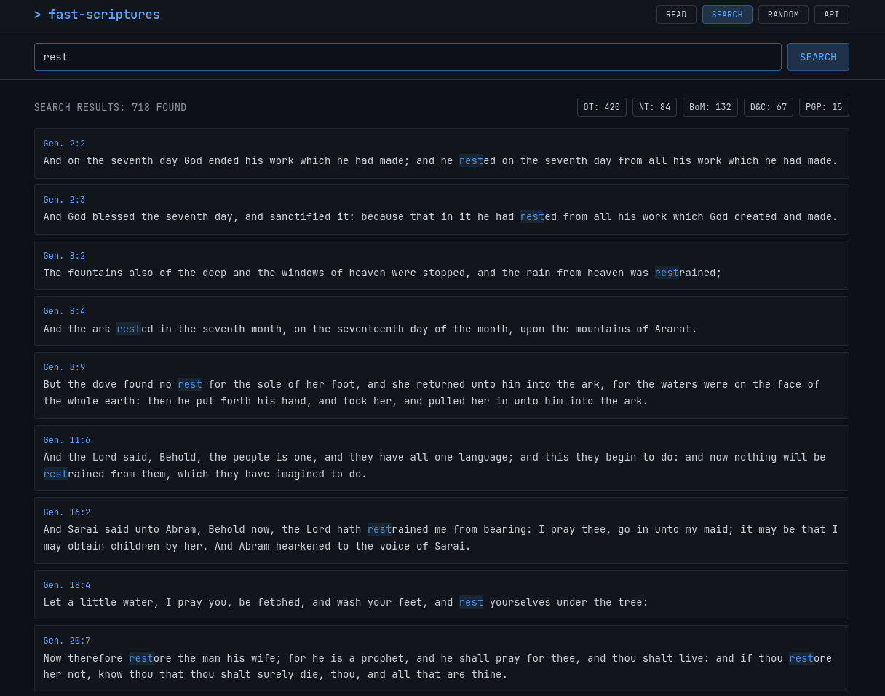
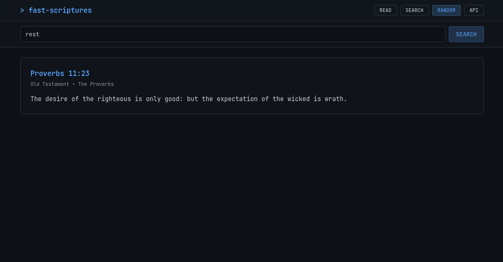
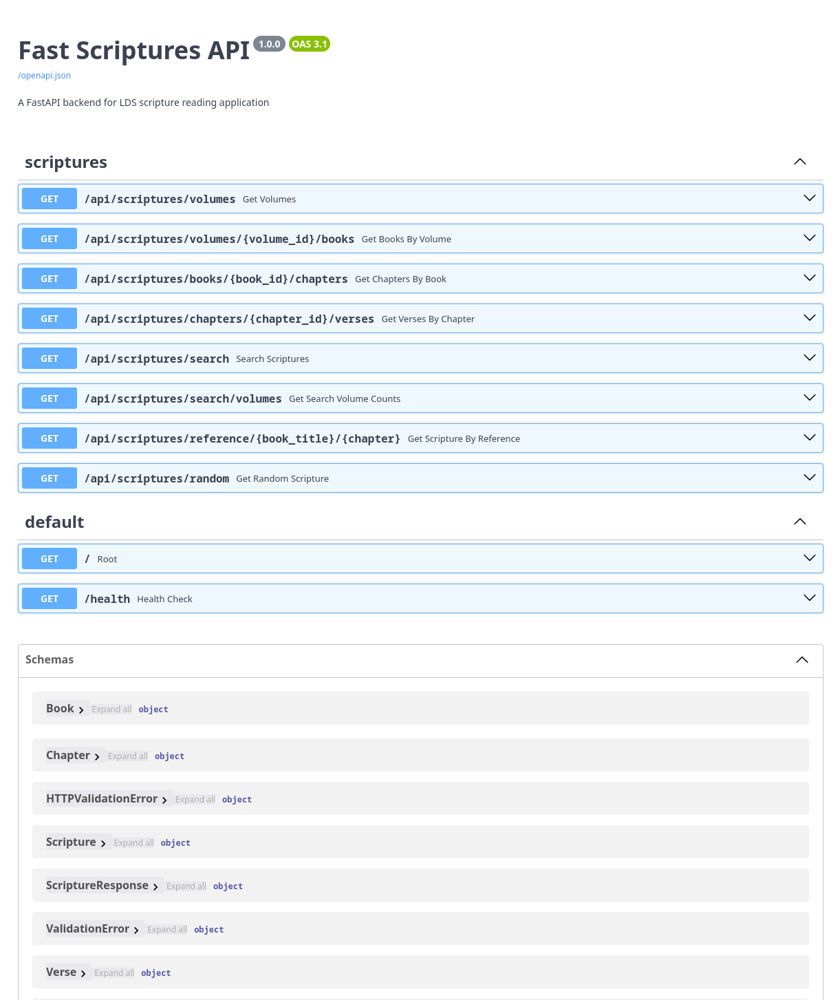

# Fast Scriptures Screenshots

Visual overview of the Fast Scriptures application features and interface.

## 📱 Main Application Interface

### Home Screen & Search

The main interface showing the dark Cursor-inspired theme, search functionality, and clean mobile-first design.

### Search Results and Filters

Search results displaying scripture matches with highlighting and filtering options to refine results by volume or book.

### Random Scripture Feature

The random scripture feature showing how users can discover inspiring verses with a single click.

## 🔗 API Documentation

### Interactive API Docs (Swagger UI)

The FastAPI-generated interactive documentation showing all available endpoints, request/response schemas, and the ability to test API calls directly in the browser.

## 🎨 Design Features

- **Dark Theme**: Cursor-inspired dark interface that's easy on the eyes
- **Mobile-First**: Responsive design that works perfectly on all device sizes
- **Clean Typography**: Easy-to-read fonts optimized for scripture study
- **Intuitive Navigation**: Simple, focused interface that doesn't distract from content
- **Fast Search**: Real-time search with highlighted results
- **Random Discovery**: One-click access to random scripture verses

## 📊 Technical Highlights

- **FastAPI Backend**: Modern Python API with automatic OpenAPI documentation
- **React Frontend**: Fast, responsive user interface built with React 18
- **SQLite Database**: Complete LDS scripture database with full-text search
- **RESTful API**: Clean, well-documented API endpoints for all functionality
- **Type Safety**: Full TypeScript support for better developer experience

---

**Live Demo**: [scriptures-fast-api.onrender.com](https://scriptures-fast-api.onrender.com)
**API Docs**: [scriptures-fast-api.onrender.com/docs](https://scriptures-fast-api.onrender.com/docs)

**Back to Documentation**: [Documentation Index](../README.md) | [Main README](../../README.md)
